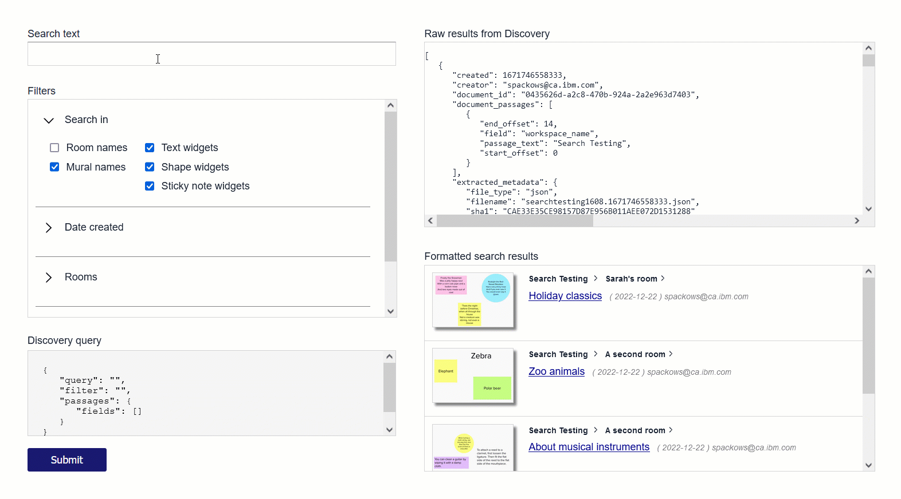

# MURAL Search
A Python Flask app for searching MURAL using IBM Watson Discovery.  

This app is part of a larger sample.  Read the blog: [Searching MURAL](https://sarah-packowski.medium.com/searching-in-mural-8aad3c224e6c) 

See also: [Demo video](https://youtu.be/FFPMoysqv5M)

&nbsp;

## How to run the sample app on your local computer

### 1. Download sample code
1. Create a local working directory
2. In your browser, navigate to the <a href="https://github.com/spackows/MURAL-search">MURAL-search GitHub repo</a>
3. Click the button labeled <code>Code</code> and then select "Download ZIP" to download the sample code
4. Uncompress the sample code into your working directory

### 2. Set up local environment
<ol>
<li>
On a command line, in the working directory, create a new local, virtual Python environment: <code>python -m venv &lt;virtual-environment-name></code>

</li>
<li>

Use the virtual environment: Windows <code>&lt;virtual-environment-name>\Scripts\activate.bat</code> UNIX or MacOS <code>source &lt;virtual-environment-name>/bin/activate</code>

</li>
<li>

In the <code>src</code> subdirectory of the sample code, install Python libraries required for the sample app: <code>pip install -r requirements.txt</code>

</li>
<li>

Set three environment variables:

<table>
<tr><td><code>DISCOVERY_APIKEY</code></td><td>You can get this from the <b>Manage</b> page of your IBM Watson Discovery intance in IBM Cloud</td></tr>
<tr><td><code>DISCOVERY_URL</code></td><td>You can get this from the <b>Manage</b> page of your Discovery intance in IBM Cloud</td></tr>
<tr><td><code>DISCOVERY_PROJECT_ID</code></td><td>You can get this from the <a href="https://github.com/spackows/MURAL-API-Samples/blob/main/notebooks/Discovery_02-Upload-documents-to-Discovery.ipynb">sample notebook</a> used to create the project or from the Discovery web interface</td></tr>
</table>
</li>
</ol>

### 3. Run the app locally
<ol>
<li>
Run the app from the <code>src</code> subdirectory: <code>python server.py</code>
</li>
<li>
Open a new browser tab with this address: <a href="http://localhost:8080">http://localhost:8080</a>
</li>
</ol>

&nbsp;

